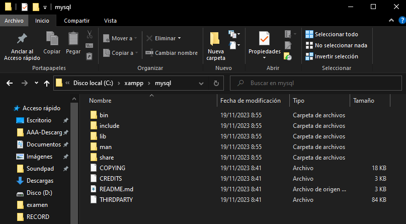
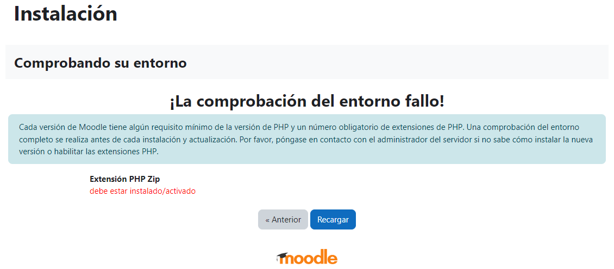
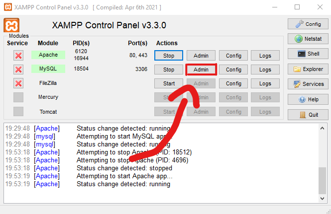
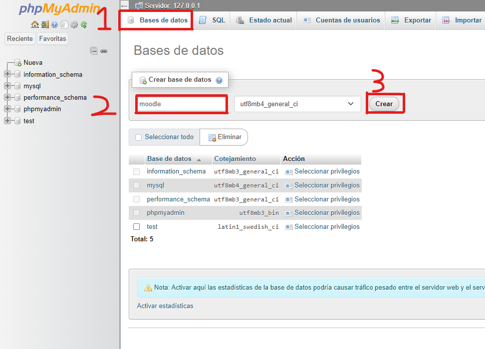
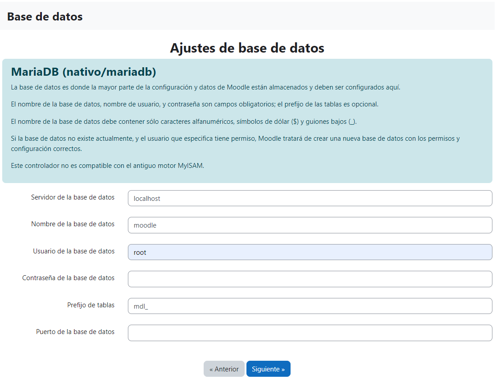
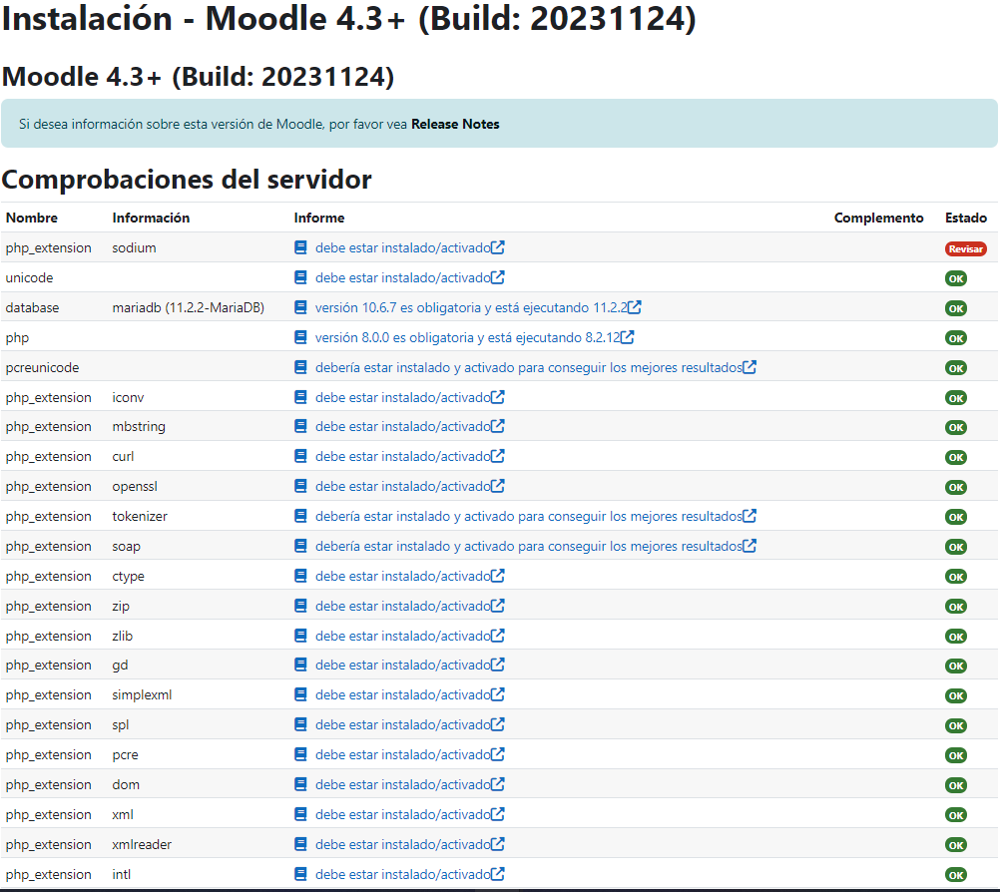
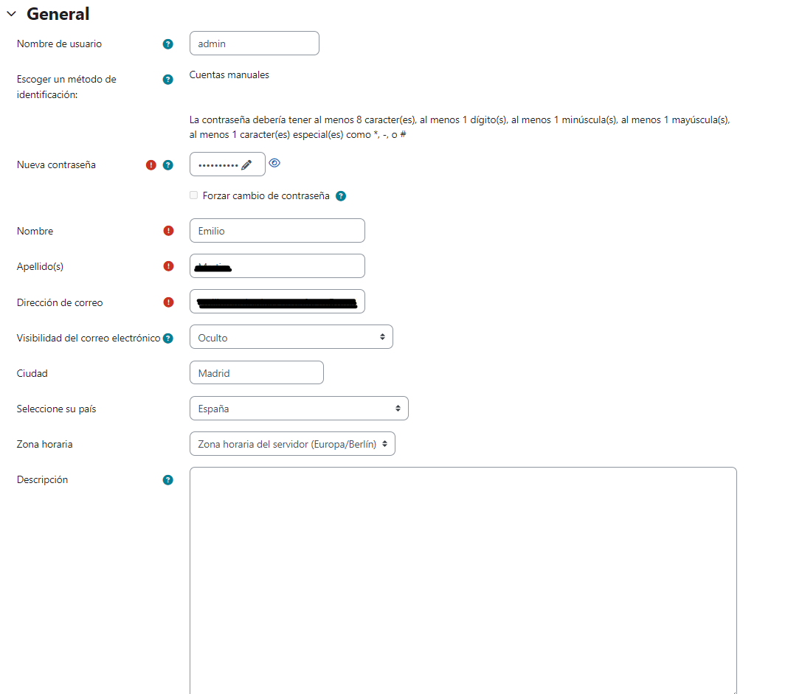

# Guía de instalación Moodle con Xampp en Windows

## Objetivo
Instalación de Moodle con Xampp en Windows, con solución de errores.

## Pre-requisitos

### HW Realizado

- Procesador Intel(R) Core(TM) i7-9700F CPU @ 3.00GHz   3.00 GHz
- RAM instalada	16,0 GB
- Gráfica NVIDIA GeForce GTX 1650
- Almacenamiento 224 GB SSD

### SW Realizado

- Windows 10 Home
- Instalación __Limpia__ [Xampp 8.2.12](https://mariadb.org/download/?t=mariadb&p=mariadb&r=11.2.2&os=windows&cpu=x86_64&pkg=zip&m=fe_up_pt)

## Instalación
### Actualización de la base de datos
Ya que la base de datos que viene por defecto en Xampp esta en la versión 10.4.32 pero Moodle nos pide como mínimo 10.6.7

Xampp no nos lo pone fácil, para ello deberemos de irnos a la [pagina oficial](https://mirrors.up.pt/pub/mariadb/mariadb-11.2.2/winx64-packages/mariadb-11.2.2-winx64.zip) y descargarnos el modo zip la ultima version estable.

### <span style="color:red">Presta atención!!!</span>
En la carpeta Xampp deberemos de cambiar el nombre ___mysql___ a ___mysql.old___, deberemos de crear una nueva carpeta llamada ___mysql___ y meteremos los archivos del zip dentro de la nueva carpeta. Y debería de quedarse asi:


Ahora deberás de copiar las siguientes carpetas e archivos por orden de lista de la carpeta ___mysql.old___ a ___mysql___:

Archivos:

- mysql_installservice.exe
- mysql_uninstallservice.exe
- resetroot.exe
- ./bin/___my.ini___ (solo el archivo)

Carpetas

- backup
- data
- scripts
- Eliminar el contenido de ___data___ y meter ___las carpetas (SOLO LAS CARPETAS)___ de backup dentro de ___data___


Si aun asi no lo entiendes, dejare un video:

[](https://youtu.be/FUYTEY8ighw)

Si has seguido bien los pasos no debería darte error, debería dejarte ejecutar el servicio de MySql en Xampp.

### Instalación de Moodle
Deberemos irnos a la [pagina oficial de Moodle](https://download.moodle.org/releases/latest/) e instalar la ultima version estable, deberemos irnos a la carpeta ___xampp/htdocs___ e ___eliminar___ todo su contenido y meter todo el contenido del zip de Moodle en su interior.

Iniciaremos en el Xampp los servicios ___Apache___ y ___MySQL___ y nos meteremos en la dirección IP local de vuestro equipo.

### Requerimientos

Durante la instalación de Moodle nos pedirá una serie de requerimientos.



Para arreglar este requerimiento y otros que nos pedirán mas adelante nos deberemos ir a la carpeta ___xampp/php___ y editar el archivo php.ini

Descomentaremos la lineas:

- ;extension=zip
- ;extension=gd
- ;extension=intl
- ;extension=sodium
- ;extension=soap
- zend_extension=opcache
- ;max_input_vars = 1000 (__cámbialo a 5000__)


Tambien agregaremos las siguientes lineas en php.ini en cualquier ubicación
````ini
[opcache]
opcache.enable = 1
opcache.memory_consumption = 128
opcache.max_accelerated_files = 4000
opcache.revalidate_freq = 60
 
; Required for Moodle
opcache.use_cwd = 1
opcache.validate_timestamps = 1
opcache.save_comments = 1
opcache.enable_file_override = 0
````

Para descomentarla solo deberemos de quitar el "__;__" \
Una vez descomentado pararemos el servicio de Apache y lo volveremos a encender.

### Creación de base de datos
Moodle utiliza una base de datos para gestionar la pagina web, durante la instalación nos pedirá crear una base de datos, para ello nos iremos al Panel de Xampp y en el apartado de MySQL le daremos al botón que pone __"Admin"__



Se nos abrirá una pagina web localmente en la cual podemos administrar la base de datos, nos iremos a la pestaña __"Base de datos"__ situada arriba y luego en el apartado de __"Crear base de datos"__ pondremos __"moodle"__ y le daremos al botón __"Crear"__

Tal como se muestra en la siguiente imagen:


Una vez creada podremos seguir con la instalación de Moodle 


Ahora nos pedirá los datos de la base de datos, si no hemos cambiado nada en la configuración de Xampp deberemos de déjalo como se muestra en la imagen superior.

### Extension sodium


Por defecto moodle nos pide unos requisitos mínimos de instalación pero como puedes ver nos queda uno que es obligatorio, para solucionarlo deberás de seguir los siguientes pasos.
### <span style="color:red">Presta atención!!!</span>
Deberemos de irnos a la carpeta __"xampp\php"__ y copiar el archivo llamado __"libsodium.dll"__ y pegarlo en __"xampp\apache\bin"__. Reiniciaremos el servicio de Apache y recargamos la pagina de Moodle.

Deberemos de esperar un rato a que se instalen todas las características de Moodle.



Ahora deberemos de rellenar los datos de inicio de sesión y de la pagina.

### Enhorabuena ya tienes el Moodle operativo


# Bibliografía
[Video de actualizar la base de datos](https://youtu.be/-GmyjYEfuzE)

[Video de como activar sodium](https://youtu.be/gcOiTv4QVZI)
